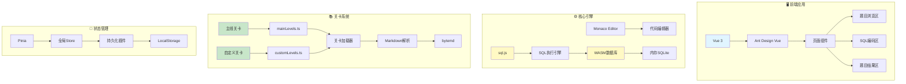
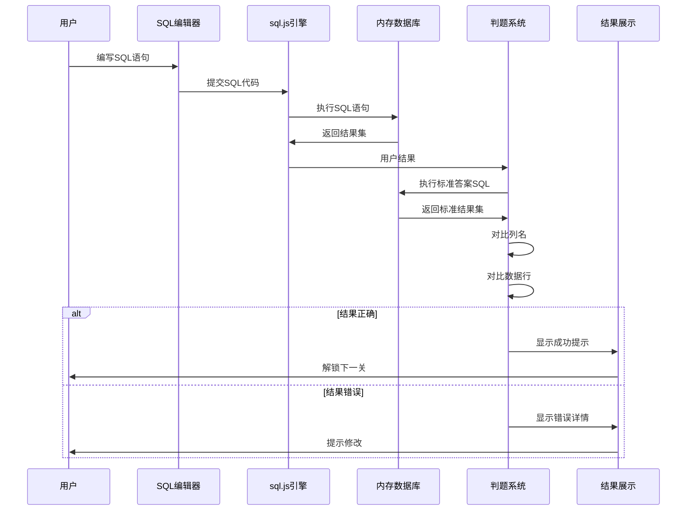
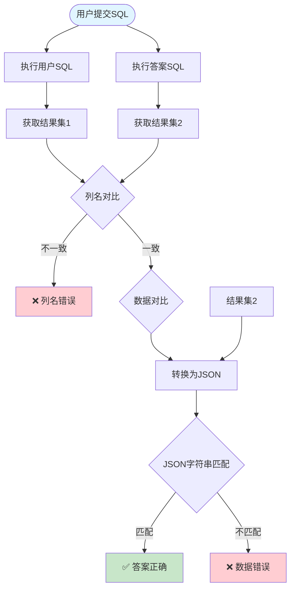
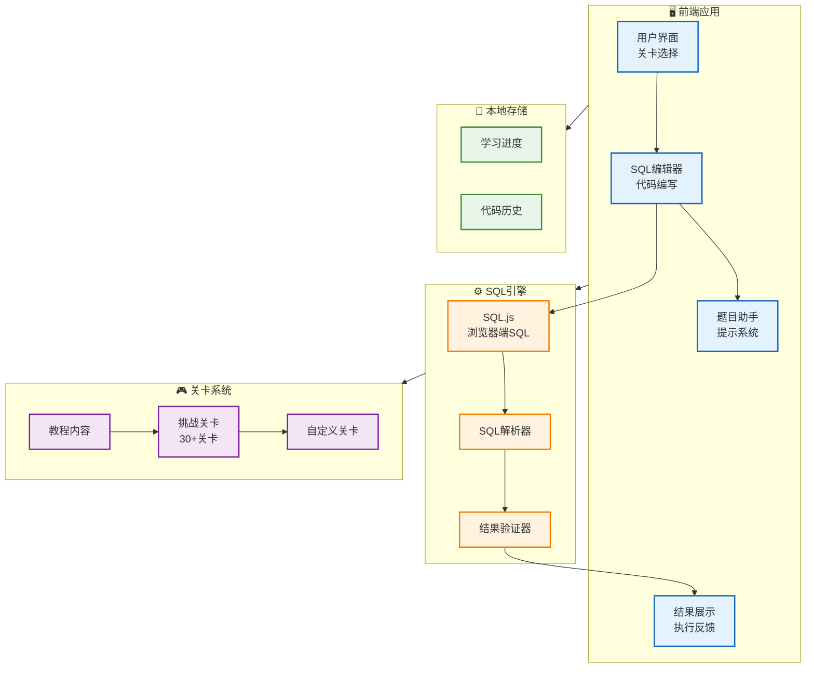
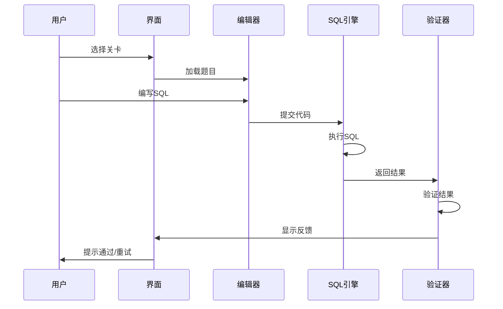

# 📚 fork-sql-mother - SQL闯关式自学网站


## 📖 项目简介

fork-sql-mother是纯前端实现的闯关式SQL自学网站,通过游戏化的方式帮助用户学习SQL语法,支持在线编辑和运行SQL语句。

## 📦 项目来源

- **原项目**: [liyupi/sql-mother](https://github.com/liyupi/sql-mother)
- **原作者**: 程序员鱼皮 (liyupi)
- **开源协议**: 未明确标注(需查看原项目)
- **Fork时间**: 2024年

## 🔧 二次开发内容

本项目为原项目的学习研究版本,主要用于:
- 学习Vue3前端开发技术
- 研究游戏化教育产品的设计思路
- 了解Monaco Editor和sql.js的应用

## ⚠️ 许可证说明

本项目原项目许可证未明确标注,仅供学习参考。

## 系统架构 | System Architecture



## 核心流程 | Core Workflow



## 判题算法 | Judging Algorithm



在线体验：http://sqlmother.yupi.icu

视频演示：https://www.bilibili.com/video/BV1pV4y1i7LW


## 项目介绍

一个完全免费的闯关式 SQL 自学教程网站，结合鱼皮自己的 SQL 学习实践经验，编写了 30 多个关卡，用户可以在线提交 SQL 代码做题闯关，目标是从 0 到 1 地带大家掌握常用的 SQL 语法。

此外,网站支持自由选择关卡、自定义关卡、SQL 在线练习广场等功能。

## 📊 系统架构



## 🎮 学习流程




### 为什么做这样一个网站？

首先，SQL 知识极为重要，几乎是程序员、产品经理、数据分析同学的必备技能。

对于 SQL 的学习，比起看教程，更适合通过实战来入门。网上虽然也有类似的 SQL 自学网，但是要么收费、要么不够体系化。

所以鱼皮决定自己动手，搞一个开源的 SQL 学习网，一方面希望能够帮助大家更轻松地入门 SQL；另一方面，也希望项目代码也能给大家一些启发，让更多同学有机会参与进来成为贡献者，一起做好一个项目！


## 20 秒学会使用

1）直接进入主页，左侧是教程和题目区域，请先完整阅读

2）在右上区域编写 SQL 代码做题，点击运行提交结果

3）可以通过右下的题目助手区域帮助自己做题

4）执行结果正确后，可以进入下一关


你也可以自由选择关卡来挑战，所有关卡都没有任何限制，不一定非要按顺序做题：


## 1 分钟本地启动

由于项目采用纯前端实现，本地启动项目非常简单！

> 在线访问人数较多，可能会卡顿，所以更推荐大家自己在本地使用~

1）下载本项目代码

2）进入项目根目录，执行 `npm install` 安装项目依赖

3）执行 `npm run dev` 本地启动即可


## 功能和特性

- 展示教程题目文档（Markdown 格式）
- 在线做题
  - 比对结果
  - 题目助手
    - 展示执行结果
    - 查看提示
    - 查看建表语句
    - 查看答案
- 关卡设置
  - 自由选择关卡
  - 主线关卡 - 支持上一关 / 下一关
  - 自定义关卡
- SQL 广场（自由输入 SQL）


## 技术选型

本项目采用纯前端实现，不需要任何后端的前置知识~

> Q：为什么采用纯前端实现？
>
> A：减少攻击风险 + 省钱 + 新的学习尝试


- 主框架：Vue 3
- 组件库：ant-design-vue
- Markdown 展示组件：bytemd + github-markdown-css 主题
- 代码编辑器：monaco-editor
- SQL 执行：sql.js
- SQL 代码格式化：sql-formatter
- 全局状态管理：pinia + pinia-plugin-persistedstate
- 前端工程化：typescript + eslint + prettier
- 工具库：lodash


## 核心设计

### 1、界面模块化

采用模块化的开发思想，把做题页面（主页）拆分为题目浏览区、SQL 编码区、题目结果区，每个区都是一个独立的 Vue 组件文件，实现了逻辑的隔离和组件的复用（比如 SQL 编码区同样可以复用到 SQL 练习广场页面）。

- 题目浏览区（QuestionBoard）：展示题目 Markdown 文档
- SQL 编码区（SqlEditor）：封装了代码编辑器、运行 / 格式化 / 重置按钮
- 题目结果区（SqlResult）：封装了题目执行结果的展示

然后在 `IndexPage.vue` 中就可以引入这些组件，并且传递关卡信息、运行结果等数据给组件，组装成一个完整的页面。


### 2、关卡设计

虽然没有后端数据库，但是仍应该把所有关卡的数据统一进行管理，所以定义了 `levels` 目录，统一存放关卡相关数据。

首先将关卡分为了两类，主线关卡（教程）和自定义关卡（便于扩展），分别在 `mainLevels.ts` 和 `customLevels.ts` 文件中进行管理。

每个关卡都是一个单独的目录，实现了关卡之间的隔离。


由于每个关卡的题目教程文章可能非常长，直接写在 ts 文件中不利于阅读和管理，所以这里的策略是把所有文章写在 `.md` Markdown 文件中，在关卡定义文件 `index.ts` 中读取 `.md` 文件。

示例代码如下，每个关卡的信息独立定义、相互隔离：

```ts
import md from "./README.md?raw";
import sql from "./createTable.sql?raw";

export default {
  key: "level1",
  title: "基础语法 - 查询 - 全表查询",
  initSQL: sql,
  content: md,
  defaultSQL: "select * from student",
  answer: "select * from student",
  hint: "请仔细查看本关给出的示例",
  type: "main",
} as LevelType;
```


### 3、纯前端 SQL 执行

纯前端是怎么操作数据库、执行 SQL 的呢？有前端经验的同学会本能地想到 `webassembly` 技术。

没错，通过 `webassembly` 技术，我们可以在浏览器中执行 JS 之外的语言（比如 C++）。但是没必要自己去实现 SQL 执行逻辑了，站在巨人的肩膀上，直接使用开源的 `sql.js` 库，就可以在前端执行自己的 SQL 操作了。

核心代码在 `src/core/sqlExecutor.ts` 中，定义了初始化 DB 和执行 SQL 两个函数，很简单：

```ts
import initSqlJs, { Database, SqlJsStatic } from "sql.js";

/**
 * SQL 执行器
 *
 * @author coder_yupi https://github.com/liyupi
 */
let SQL: SqlJsStatic;

/**
 * 获取初始化 DB
 * @param initSql
 */
export const initDB = async (initSql?: string) => {
  if (!SQL) {
    SQL = await initSqlJs({
      // Required to load the wasm binary asynchronously
      locateFile: () =>
        "https://cdn.bootcdn.net/ajax/libs/sql.js/1.7.0/sql-wasm.wasm",
    });
  }
  // Create a database
  const db = new SQL.Database();
  if (initSql) {
    // Execute a single SQL string that contains multiple statements
    db.run(initSql); // Run the query without returning anything
  }
  return db;
};

/**
 * 执行 SQL
 * @param db
 * @param sql
 */
export const runSQL = (db: Database, sql: string) => {
  return db.exec(sql);
};

```

在关卡加载时，会先执行关卡对应的初始化 SQL 语句完成建表和导入示例数据，然后用户就可以编写 SQL 查询表中的数据了。


### 4、判题机制

和判题相关的代码全部集中定义在 `src/core/result.ts` 文件中，包括定义了几种执行状态，以及判断结果是否正确的函数。

如何判断用户的 SQL 语句是否正确呢？

不是直接去对比用户的输入语句和我们预设的答案是否一致（那样太死板了），而是依次执行以下 3 个操作：

1. 分别提交用户的输入语句和答案语句，得到两份结果表
2. 判断两个结果表输出的列名是否一致（名称和顺序都要一致）
3. 判断两个结果表输出的数据是否一致

这里作者用了个 trick 方式来对比数据，直接把两份结果集转为 JSON 格式，对比 JSON 字符串是否一致即可，而不是多重 for 循环。


## 目录结构

- public：公共静态资源
- doc：文档相关资源
- src
  - assets：静态资源
  - components：组件
    - CodeEditor.vue：代码编辑器
    - MdViewer.vue：Markdown 浏览
    - QuestionBoard.vue：题目面板（教程区）
    - SqlEditor.vue：SQL 编辑器（练习区）
    - SqlResult.vue：SQL 执行结果（结果区）
    - SqlResultTable.vue：SQL 结果表格
  - configs：配置
    - routes：路由
  - core：核心
    - sqlExecutor.ts：SQL 执行引擎
    - result.ts：执行结果相关变量和函数
    - globalStore.ts：全局状态管理
  - levels：关卡
    - custom：自定义关卡
    - main：主线关卡
      - level1：每个关卡都是一个单独的目录
        - createTable.sql：关卡依赖的建表语句
        - index.ts：关卡的定义
        - README.md：关卡教程
    - index.ts：定义了关卡相关变量和函数
    - level.d.ts：关卡类型定义
    - mainLevels：主线关卡列表
    - customLevels：自定义关卡列表
  - pages：页面
    - IndexPage.vue：主页
    - LevelsPage.vue：关卡页面
    - PlaygroundPage.vue：广场页面
  - App.vue：主页
  - main.ts：Vue 主文件
  - style.css：全局样式文件
  - vite-env.d.ts：环境定义
- .eslintrc.js：代码规范
- .gitignore：提交忽略文件
- index.html：静态主页
- package.json：项目管理
- tsconfig.json：TS 配置
- vite.config.ts：打包工具配置


## 贡献指南

欢迎各路好汉参与贡献，利人利己~

目前有几种推荐的贡献方式：


### 1、贡献关卡

在贡献关卡前，请确保你已经理解了本项目加载关卡的方式。

为保证教程的连贯性，更推荐贡献 `自定义关卡` 而不是主线关卡，更容易被合并。

贡献自定义关卡的步骤：

1）复制 `src/levels/custom/自定义关卡模板` ，将目录名改为自己的关卡中文名

2）修改模板中的 `createTable.sql` 建表语句，导入默认数据

3）修改模板中的 `index.ts` 文件，设置关卡的中英文名、默认 SQL、答案 SQL、提示等

4）修改模板中的 `README.md` 文件，更改标题和题目内容，需要给出表结构信息、并且尽量把题目表达清楚（比如必须按照某个顺序输出）

5）在 `customLevels.ts` 文件中引入自定义的关卡。

> 注意，本项目仅支持 SQLite 语法（基本上是通用的 SQL）！不要使用太花里胡哨的函数！


### 2、完善关卡

比如修复关卡的错误、优化关卡的文案使其更易于理解或增加更多干货、调整关卡的难度等。


### 3、项目扩展

本项目仅为鱼皮一人开发，时间和精力有限，很多地方没有做到完善，欢迎大家给项目进行扩展，打造属于自己的 SQL 之子、SQL 之孙、SQL 之曾孙系列产品。。。

一些可能的扩展思路：

1. 点击 “提交” 题目后，自动展开执行结果区域
2. 过关后，给出更友好的过关提示，可以更方便地到达下一关
3. 支持 SQL 一键格式化
4. 优化关卡加载机制，按需加载
5. 给项目增加一个后端，用数据库来存放关卡数据，并且支持在线提交 / 审核关卡
6. 增加过关排行榜


---


感谢阅读，也欢迎加入 [作者的编程学习圈](https://yupi.icu)，学习更多原创项目~
